# 电商用户价值分层分析：基于千万级行为日志的 RFM-I 模型重构

## 1. 项目背景与目标

在现代电商运营中，传统的 RFM 模型仅通过“结果性数据”（交易金额与频次）对用户进行分类，难以捕捉用户在转化前的“过程性行为”。本项目旨在通过分析海量用户行为日志，引入意向度（Intent）指标，重构 RFM-I 模型，从而精准识别高潜但未转化的用户，并制定针对性的营销策略。

#### 目录结构说明

## 目录结构说明

```text
├── archive/                  # 原始数据集存放目录 (13GB CSV，需自行下载)
├── images/                   # Markdown 文档依赖的静态图片
├── Duckdb/                   # DuckDB 数据库持久化文件目录
├── project.duckdb            # 抽样/全量数据库文件
├── features.py               # Python 数据清洗、分箱与打分逻辑脚本
├── BI_data.csv               # 导出供 Power BI 使用的宽表数据
├── RFM_I_Dashboard.pbix      # Power BI 可视化源文件
└── README.md                 # 项目核心技术与业务分析报告
```

## 2. 数据源说明

- **数据集名称：** eCommerce behavior data from multi category store
- **数据来源：** Kaggle (REES46)
- **下载链接**：[eCommerce behavior data from multi category store](https://www.kaggle.com/datasets/mkechinov/ecommerce-behavior-data-from-multi-category-store)
- **数据体量：** 原始数据包含 2019 年 10 月与 11 月的完整行为日志，单文件最高达 8.7GB，总体积约 13.7GB，记录数千万条。
- **核心字段：** `event_time`, `event_type` (view, cart, purchase), `product_id`, `price`, `user_id`, `user_session` 等。

| **字段名称**    | **业务释义**             | **示例**                                                     |
| :-------------- | ------------------------ | ------------------------------------------------------------ |
| `event_time`    | 行为发生的时间（UTC）    | `2019-10-01 00:00:00 UTC`                                    |
| `event_type`    | 行为类型（转化漏斗节点） | `view` (浏览), `cart` (加购), `remove_from_cart` (移出购物车), `purchase` (购买) |
| `product_id`    | 商品的唯一标识符         | `44600062`                                                   |
| `category_id`   | 商品所属类目 ID          | `2103807459595387724`                                        |
| `category_code` | 商品类目的层级名称       | `electronics.smartphone`                                     |
| `brand`         | 商品品牌名称             | `apple`, `samsung`                                           |
| `price`         | 商品价格                 | `289.52`                                                     |
| `user_id`       | 用户的唯一标识符         | `541312140`                                                  |
| `user_session`  | 用户单次访问的会话 ID    | `72339d2c-1b73-426b-80a6...`                                 |

## 3.架构设计

### 3.1 技术栈选型

- **分析引擎：** DuckDB (嵌入式分析型数据库)
- **编程语言：** Python 3.12
- **管理工具：** DBeaver (数据库管理), VS Code (IDE)


### 3.2数据抽样与导入

**我们使用 Python 脚本连接 DuckDB，从原始数千万条 CSV 数据中按 1% 比例进行伯努利随机抽样，并将抽样结果存入 `.duckdb` 数据库文件中**

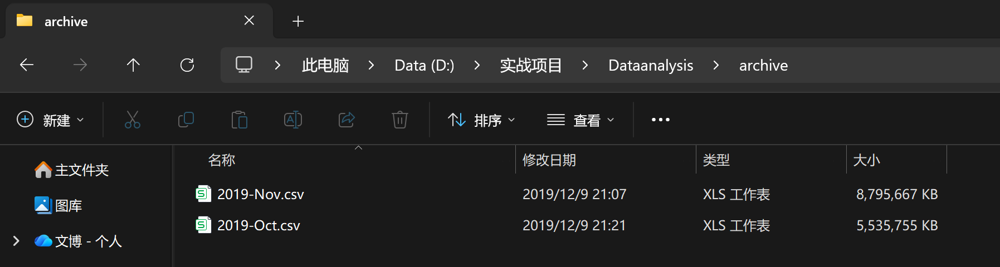

```
import duckdb
db_path = r'D:\实战项目\Dataanalysis\Duckdb\project.duckdb'
con = duckdb.connect(database=db_path)

csv_path = r'D:\实战项目\Dataanalysis\archive\*.csv'


sample_query = f"""
    CREATE TABLE sample_events AS 
    SELECT * FROM read_csv_auto('{csv_path}')
    USING SAMPLE 1% (bernoulli);
"""
con.execute(sample_query)
con.close()
```


### 3.3DBeaver连接Duckdb数据库

抽样完成后，可以通过 DBeaver 连接刚才生成的 `project.duckdb` 文件来查看数据：

1. 在 DBeaver 中新建 DuckDB 连接，路径选择上述代码中生成的 `project.duckdb`。
2. 依次在左侧导航栏展开 `project` -> `main` -> `Tables`。
3. 双击 `sample_events` 表即可预览抽样后的数据集。

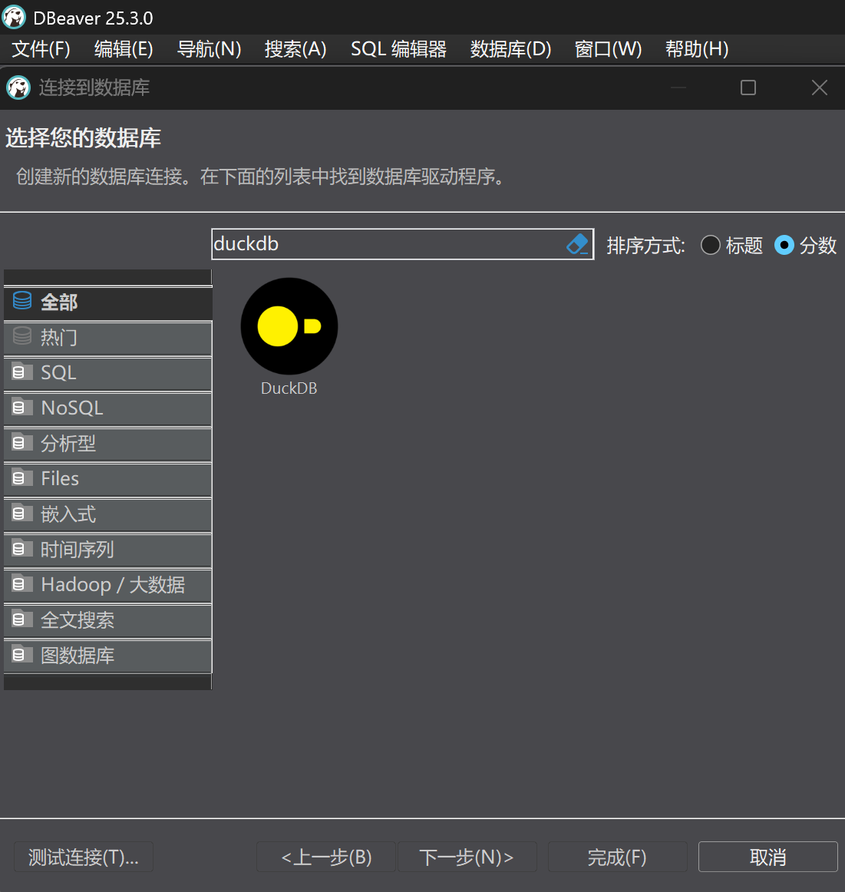

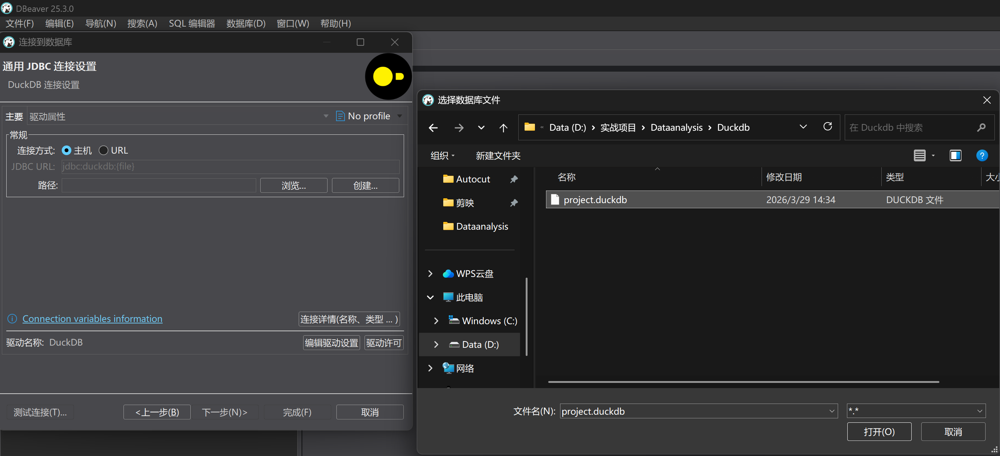

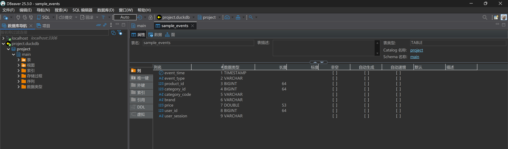	

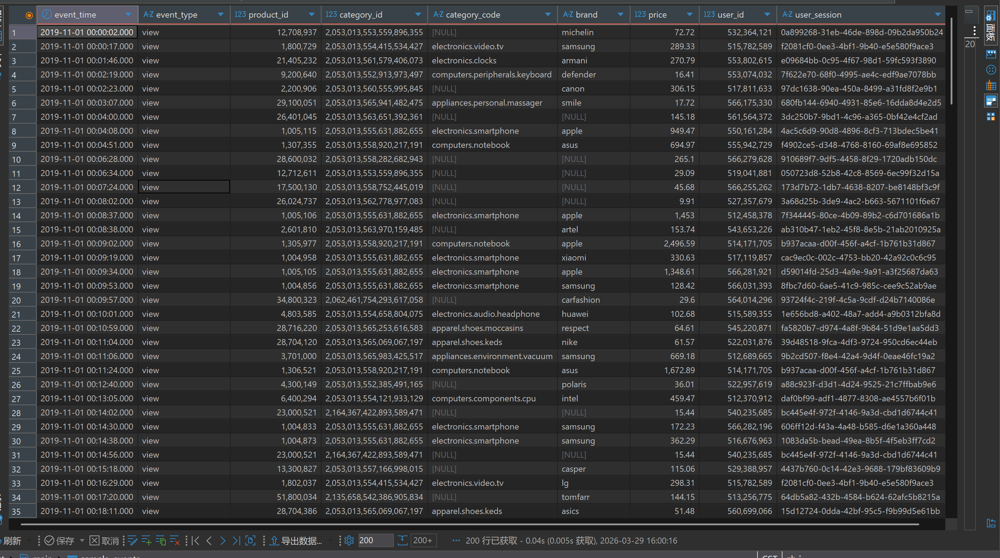

## 4.SQL指标逻辑拆解

### 4.1用户特征层

原始数据是按时间顺序记录，为了建立用户画像，我们需要以 `user_id` 进行分组，把数据从“单次行为”汇总成以“人”为单位的基础特征。

**Recency (最近一次购买时间)**：筛选 `purchase` 行为的最新时间。

**Frequency (购买频次)**：统计 `purchase` 行为的总次数。

**Monetary (消费总金额)**：统计 `purchase` 行为的商品价格。

**Intent (购买意向)**：统计 `view`（浏览）和 `cart`（加购）的总次数。

```
SELECT user_id user_id,
	MAX(CASE WHEN event_type = 'purchase' THEN event_time ELSE NULL END) Recency,
	COUNT(CASE WHEN event_type = 'purchase' THEN  1 ELSE NULL END) Frequency,
	SUM(CASE WHEN event_type = 'purchase' THEN price ELSE 0 END) monetary,
	COUNT(CASE WHEN event_type IN ('view', 'cart') THEN 1 ELSE NULL END) Intent
FROM sample_events
GROUP BY user_id;

```

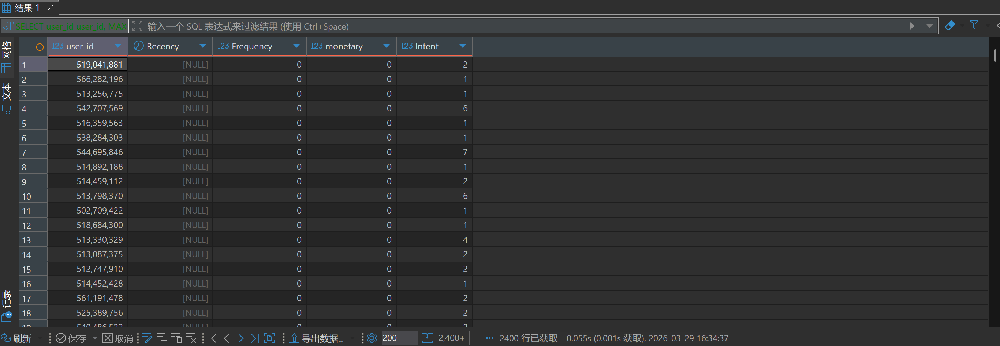


计算会话时长需要依据 `user_session`。我们先在内部子查询算出每个 Session 的时长（最大时间减最小时间），然后再按 `user_id` 算出平均值 `avg_session`。

```
SELECT 
	user_id,
	AVG(session_duration) avg_session ,
FROM (SELECT 
		 user_id,
		 (MAX(event_time) - MIN(event_time)) session_duration
	 FROM sample_events
	 WHERE user_session IS NOT NULL
	 GROUP BY user_id,user_session
	 ) A 
GROUP BY user_id;
```

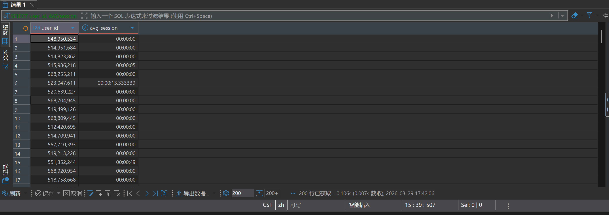


用**WITH语句**将两表结合起来（这里没有用LEFT JOIN 是因为再套一层的话会显得逻辑乱，而用WITH语句可以降低排错难度）

```
WITH t1 AS (
SELECT user_id user_id,
	MAX(CASE WHEN event_type = 'purchase' THEN event_time ELSE NULL END) Recency,
	COUNT(CASE WHEN event_type = 'purchase' THEN  1 ELSE NULL END) Frequency,
	SUM(CASE WHEN event_type = 'purchase' THEN price ELSE 0 END) monetary,
	COUNT(CASE WHEN event_type IN ('view', 'cart') THEN 1 ELSE NULL END) Intent
FROM sample_events
GROUP BY user_id),

t2 AS (
SELECT 
	user_id,
	AVG(session_duration) avg_session
FROM (SELECT 
		 user_id,
		 user_session,
		 (MAX(event_time) - MIN(event_time)) session_duration
	 FROM sample_events
	 WHERE user_session IS NOT NULL
	 GROUP BY user_id,user_session
	 ) A 
GROUP BY user_id)


SELECT 
t1.*,
t2.avg_session
FROM t1 LEFT JOIN t2 ON t1.user_id = t2.user_id;
```

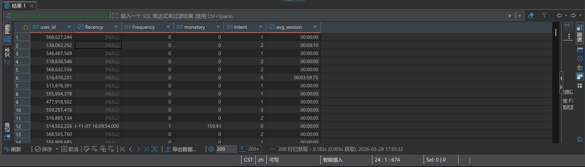

## 5.数据标准化

###  5.1 数据读取与基础概况检查

```py
import duckdb
import pandas as pd
import matplotlib.pyplot as plt
import seaborn as sns

con = duckdb.connect(r"D:\实战项目\Dataanalysis\Duckdb\project.duckdb")
#project.duckdb更换成你的数据库路径
df = con.execute("SELECT * FROM user_features").df()
print(df.head())
print(df.info())
```

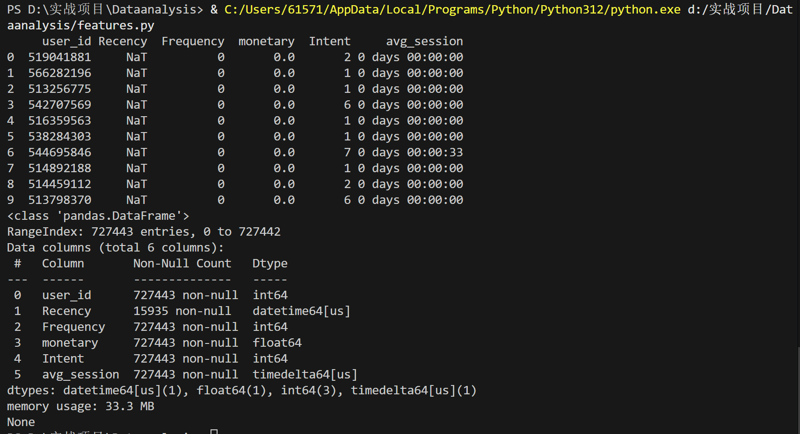

（在这里**Frequency**的数这么大的原因是在sql里用是的**count**函数，所以会导致为null值的空被看作了0，所以这里**df.info()**就会导致跟行数一样）

**RangeIndex**: 727,443（说明我们抽样出来的数据有727,443条）

**Recency **: 15,935（只有 1.6 万人有最后购买时间）

这里能大致看出来在抽样的数据中是有98%左右的人是“只逛不买”


目前的 `Recency` 是日期格式，`avg_session` 是时长格式，无法直接进行 RFM 打分。我们需要将它转换成纯数字。

```
#确定参考日期(Recency里最大的一天)
reference_date = df['Recency'].max()
#计算差值
diff = reference_date - df['Recency']
#将差值转换为天数
df['R_days'] = diff.dt.days
#处理空值(这里空值填大的数方便后续分析，因为rfm需要按R_days从小到大排序，天数越小越好)
df['R_days']=df['R_days'].fillna(99999)
print(df[['Recency','R_days']].head(10))
```

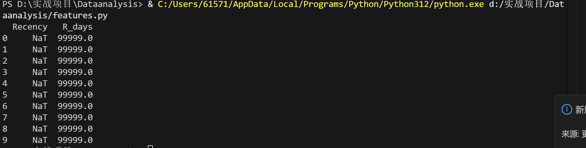

### 5.2 核心时间特征转换（R值与会话时长）

avg_session转为“总秒数”

```
#avg_session（时长）转为“总秒数”
df[session_seconds] = df[avg_session].dt.total_seconds()
#处理空值(这里空值填0，表示没有会话时长)
df[session_seconds] = df[session_seconds].fillna(0)
```

| `.dt.seconds`         | 只返回"秒"部分（不包含天、小时、分钟） | `1天2小时3分4秒` → `4秒`     |
| --------------------- | -------------------------------------- | ---------------------------- |
| `.dt.total_seconds()` | 返回完整的总秒数                       | `1天2小时3分4秒` → `93784.0` |

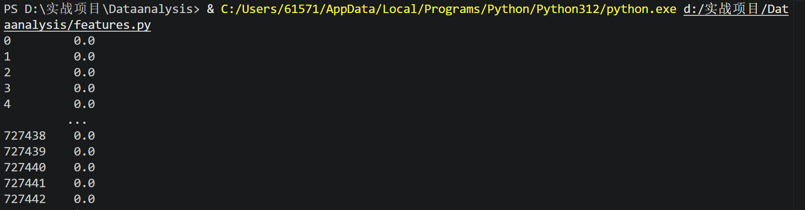


## 6.特征工程

#### 6.1人群物理切分

```
#筛选出“成交用户”（有购买记录的人，即频次大于0）
df_active = df[df['Frequency'] > 0].copy()

#筛选出“潜客”（只逛不买的人，即频次等于0）
df_potential = df[df['Frequency'] == 0].copy()
```

大致查看成交用户**df_active**数据分布情况

```
distribution_stats = df_active[['R_days','Frequency','monetary']].describe(
    percentiles=[0.25, 0.5, 0.75,0.90,0.95,0.99]
)
print(distribution_stats.round(2))
```

运行结果

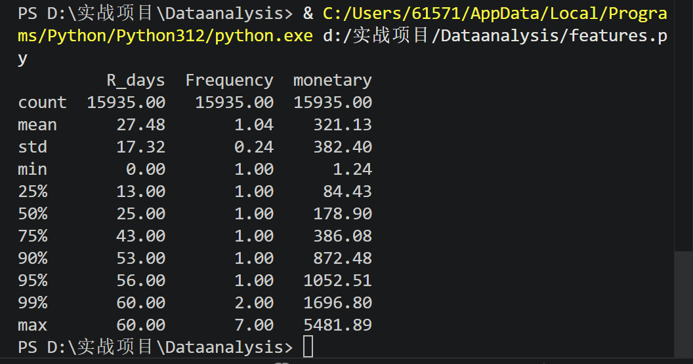

**业务理解及下一步方向**

 R （最近一次消费间隔）的业务思考：通过数据分布可以看出，R_days的范围在 0 到 60 天之间,中位数（50%)为25天，意味着一半的成交用户已经快一个月没有复购了，而有25%的用户超过43天未消费，处于极高的流失边缘。

​	下一步：计划采用等频分箱pd.qcut将R_days均匀分为5个梯队


 M（消费金额）的业务思考：我们可以发现99%的用户消费金额在1696以下，而max高达 5481 元。 如果采用传统的5分制会极易导致头部极高净用户和普通中等客户被’折叠‘进同一个最高评分档位。模型将会失去对头部客群的区分度。

​	下一步：打破传统的5分制区分客群，采用自定义绝对阈值分箱，为M指标增设"6分"专属档位，从			而精准锚定 Top 1% 的高价值“鲸鱼用户”


F（购买频次）的业务思考：观察数据分布可知，高达95%的成交客户购买频次F = 1，数据呈现"长尾特征"。这意味着传统的RFM模型中依赖F指标划分用户忠诚度的逻辑在这里不太标准。

​	下一步：进行特征降维补充。引入跨纬度的"**Intent (购买意向)**：统计 `view`（浏览）和 `cart`（加			购）的总次数"，用行为历史弥补单次交易数据的盲区。

```
#R_score:按照传统模型5分制
df_active['R_score'] = pd.qcut(df_active['R_days'],q=5,labels=[5,4,3,2,1])

#F_score：按照传统模型5分制
f_bins = [0,1,2,3,4,np.inf]
df_active["f_score"] = pd.cut(df_active['Frequency'], bins=f_bins, labels=[1,2,3,4,5])

#M_score：增加6分档，因为有些客户的消费金额非常大，远超其他客户，导致分档不均衡
#np.inf的作用，因为我们现在分析的数据是抽样出来，防止有个别客户的消费金额过大，导致分档不均衡，所以设置一个很大的数作为最后一个分档的上限，确保所有客户都能被合理分档。
m_bins  = [0,100,200,400,900,2000,np.inf]
df_active['M_score'] = pd.cut(df_active['monetary'] , bins=m_bins, labels=[1,2,3,4,5,6])

#R_score，为成交用户增加行为维度
df_active['I_score'] = pd.qcut(df_active['Intent'].rank(method = 'first'),q=5,labels=[1, 2, 3, 4, 5]
)
```

#### 6.2基于业务逻辑的规则分层

##### **（1）成交用户分析**

 核心逻辑设计:

用户标签分层逻辑：基于 **MECE 原则**（**“相互独立、完全穷尽”的分析方法，用于确保问题拆解或信息分类既不重复又不遗漏）**的用户分层业务逻辑推导。基于**帕累托法则**，切分利润基本盘 (M * R)商业的本质是 20% 的客户贡献 80% 的利润。

| **用户标签**     | **命中逻辑 (核心维度)** | **业务定义与洞察**                                           |
| ---------------- | ----------------------- | ------------------------------------------------------------ |
| **超级核心 VIP** | M>=5且R>=4              | 消费金额极高且近期非常活跃                                   |
| **重要挽留大客** | M>=5且R<=2              | 大客户流失， 曾经贡献巨大，但近期不来了，必须人工干预防止流失。 |
| **高潜单次大客** | F=1,M>=4且I>=4          | 只买过一次，但花钱多且互动极强。这就是利用 I 指标找出的“二购”头号种子。 |
| **高互动普通客** | M<4且I>4                | 消费一般但非常爱逛。适合做内容种草，提升其客单价。           |
| **边缘一次性客** | F=1,M<=2,I<=2           | 买完就走，基本不再互动，营销价值极低。                       |

```
# 定义分层规则函数
def get_active_segment(row):
    r,f,m,i = row['R_score'],row['F_score'],row['M_score'],row['I_score']
    if m >= 5 and r>= 4:
        return'核心高价值客户'
    elif m >= 5 and r<= 2:
        return'重要挽留客户'
    elif f == 1 and m>=4 and i>=4:
        return'高潜单次大客'
    elif m < 4 and i>= 4:
        return'高互动普通客'
    elif f == 1 and m <= 2 and i<=2:
        return'低价值流失客'
    else:
        return'一般客户'

df_active['用户标签'] = df_active.apply(get_active_setmgent,axis=1)
print(df_active['用户标签'].value_counts())
```

运行结果
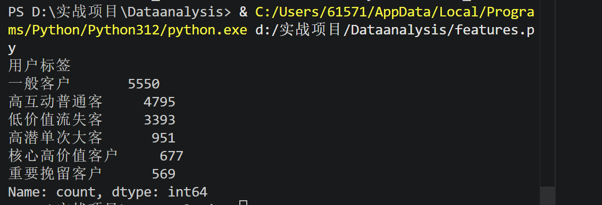

现在我们对这些成交客户进行了标签划分，下一步我们需要分层画像与价值验证。

```
#核心聚合计算
profile_active = df_active.groupby('用户标签').agg(
    用户数=('user_id','nunique'),           # 统计绝对去重人数
    总营收GMV=('monetary','sum'),           # 该群体的总贡献金额
    客单价ARPU=('monetary','mean'),         # 该群体平均每人花多少钱
    平均频次F=('Frequency','mean'),         # 平均购买次数
    平均间隔天数R=('R_days','mean')         # 平均多久没来
).reset_index()
#计算大盘总基数
total_revenue = profile_active['总营收GMV'].sum()
total_users = profile_active['用户数'].sum()

#计算人数占比 vs 营收占比
profile_active['人数占比'] = (profile_active['用户数'] / total_users).round(2)
profile_active['营收占比'] = (profile_active['总营收GMV'] / total_revenue).round(2)


# 格式化输出
display_df = profile_active.copy()
display_df['人数占比'] = display_df['人数占比'].apply(lambda x: f"{x:.2%}")
display_df['营收占比'] = display_df['营收占比'].apply(lambda x: f"{x:.2%}")
display_df['总营收GMV'] = display_df['总营收GMV'].round(2)
display_df['客单价ARPU'] = display_df['客单价ARPU'].round(2)
display_df['平均间隔天数R'] = display_df['平均间隔天数R'].round(1)
pd.set_option('display.max_columns', None)
pd.set_option('display.width', 1000)
pd.set_option('display.unicode.ambiguous_as_wide', True)
pd.set_option('display.unicode.east_asian_width', True)
print(display_df)
```

运行结果

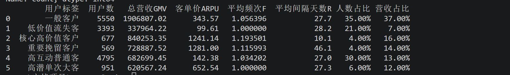

本次分层结果完美印证了“帕累托法则（二八定律）”在电商业务中的表现：仅占大盘 **8%** 的头部用户（核心高价值 + 重要挽留）贡献了 **30%** 的总营收。同时，数据暴露出严重的利润流失风险（挽留客群平均 R 值高达 46.1 天）以及巨大的复购挖掘空间（高潜单次大客贡献了 12% 的营收但 F 仅为 1）。

**核心高价值客户**：

​	数据表现：仅占总人数的**4%**，却贡献了**16%**的营收。客单价高达**1241.14**元，且活跃度极高（平均间隔R仅10天左右）

​	业务洞察：这部分客户是平台最优质的资产。无需采用价格战或者打折券进行营销，应全面倾斜VIP权益（如专属客服、极速退款、新品优先试用），以极致的服务体验锁定其生命周期价值（LTV）。

**重要挽留客户**:

​	数据表现：人数占比 **4%**，贡献 **14%** 的营收。客单价全站最高（**1281.00** 元），但平均间隔天数 R=46.1 天，处于极度危险的流失边缘。

​	业务洞察：这是当前业务的最高优先级干预对象。这 4% 用户的流失将直接导致大盘营收缩水。必须立刻拉取该群体名单，实施强力召回动作（如人工客服致电回访、定向派发大额无门槛“老客召回券”）。

**高潜单次大客**：

​	数据表现：人数占比 **6%**，贡献 **12%** 的营收。其客单价达到 **652.54** 元（远超大盘均值），但平均频次 F=1.0。

​	业务洞察：模型引入 I（意向）指标后精准捕获的战略人群。他们具备极高的消费力，且近期有活跃行为（R=27.3天与一般客户持平）。营销部门应将“首单转复购”的预算全量倾斜于此，通过基于其浏览/加购轨迹的算法推荐和定向优惠，诱发其产生第二单交易。

**一般客户**：

​	数据表现：人数最多（**35%**），贡献了最大的营收体量（**37%**）。客单价 343.57 元，处于中位数水平，指标表现平稳。

​	业务洞察：大盘的稳定器。维持常规的自动化营销节奏（如大促短信、常规满减活动）即可，无需过度投入额外人工成本。

**高互动普通客**：

​	数据表现**：人数占比庞大（**30%**），营收占比 **13%**。客单价偏低（142.38 元），但具有一定的互动意愿。

​	业务洞察：对价格敏感度高。适合作为平台的流量活跃基数，运营策略应主打“低客单价引流款”或“拼团/裂变活动”，通过小额高频的交易维持其黏性。

**低价值流失客**：

​	数据表现：人数占比 **21%**，但营收仅占 **7%**。客单价全站最低（99.61 元），频次为绝对的 1.0。

​	业务洞察：典型的“羊毛党”或低价值长尾。在营销预算有限的情况下，建议将这 21% 的人群列入营销黑名单，停止短信和广告触达，以大幅度节省营销成本（ROI 极低）。


##### **（2）未成交'潜客'分析**

```
# 查看潜客 I(互动次数) 和 S(停留秒数) 的真实分布

print(df_potential[['Intent', 'session_seconds']].describe(
    percentiles=[0.5, 0.75, 0.80, 0.90, 0.95, 0.99]
).round(2))

```

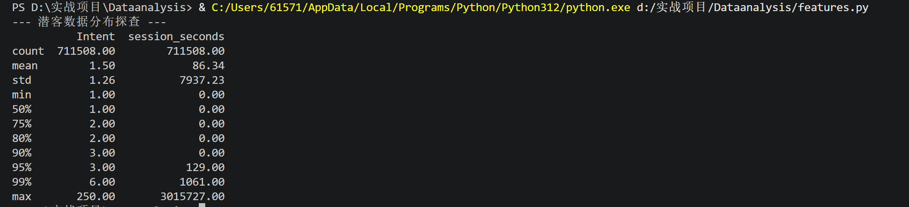

高达 90% 以上的潜客停留时长（session_seconds）为 0

**核心逻辑设计：**

针对频次为 0 的未成交潜客，传统交易特征失效。本环节基于 **Intent 互动频次**与 **S：session_seconds 会话时长**，采用绝对阈值分箱（`pd.cut`），将海量潜客精准降维划分为 5 大意向梯队，以指导精细化的流量承接与转化策略。

| **用户标签**       | **命中逻辑 (核心维度)** | **业务定义与洞察**                                           |
| ------------------ | ----------------------- | ------------------------------------------------------------ |
| **核心高意向潜客** | I>=4 且 S>=4            | **深度探索，临门一脚。** 互动频次与停留时间均处于极高梯队，对商品展现出强烈购买意向，是距离首单转化最近的“准客户”。 **建议动作：** 集中预算定向推送新人首单无门槛大额券，极速促转化。 |
| **高时长静默潜客** | I<4 且 S>=4             | **深度观望，犹豫不决。** 页面停留极长但缺乏有效交互（如加购）。属“高决策成本型”用户，可能在对比参数或阅读评价。 **建议动作：** 排查优化详情页（PDP）卖点呈现，或通过智能客服弹窗主动介入打破静默。 |
| **浅层高频交互客** | I>=4 且 S<=2            | **快速比价，漫无目的。** 短期内疯狂点击但火速跳出。典型特征为未匹配到精准需求或纯比价行为。 **建议动作：** 优化推荐系统（RecSys）的人货匹配精准度，或使用限时秒杀弹窗截留注意力。 |
| **尾部低价值流量** | I<=2 且 S<=2            | **无效流量，秒退跳出。** 互动极少且停留极短的底层流量，转化概率与营销价值极低。 **建议动作：** 营销端作战略性放弃，停止短信与广告触达，严格控制单客获取成本（CAC）。 |
| **常规培育客群**   | 其他区间组合            | **普通访客，长效蓄水。** 意向度与时长表现中规中矩的普通流量盘。 **建议动作：** 纳入自动化运营策略（如站内 Push、常态化类目活动），进行低成本长期心智培育。 |

```
i_bins = [0, 1, 2, 3, 5, np.inf]
df_potential['I_score'] = pd.cut(df_potential['Intent'], bins=i_bins, labels=[1, 2, 3, 4, 5]).astype(float)
s_bins = [-1, 0, 60, 180, 600, np.inf]
df_potential['S_score'] = pd.cut(df_potential['session_seconds'], bins=s_bins, labels=[1, 2, 3, 4, 5]).astype(float)

# 定义潜客分层逻辑函数
def get_potential_segment(row):
    i, s = row['I_score'], row['S_score']
    
    # 逻辑 A：高互动 + 高停留
    if i >= 4 and s >= 4:
        return '核心高意向潜客'
    
    # 逻辑 B：低互动 + 高停留
    elif s >= 4 and i < 4:
        return '高时长静默潜客'
    
    # 逻辑 C：高互动 + 低停留
    elif i >= 4 and s <= 2:
        return '浅层高频交互客'
    
    # 逻辑 D：低互动 + 低停留
    elif i <= 2 and s <= 2:
        return '尾部低价值流量'
    
    else:
        return '常规培育客群'
df_potential['用户标签'] = df_potential.apply(get_potential_segment, axis=1)
print(df_potential['用户标签'].value_counts())

```

运行结果

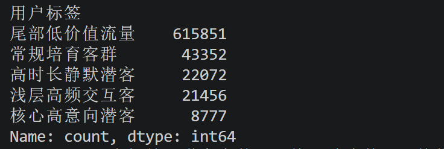

分析:86.5% 的尾部流量证明了未经清洗的原始流量存在极高的“噪音”，而 3.1% 的静默客与 3.02% 的浅层客体量高度一致，揭示了当前平台在“内容决策转化”与“推荐算法匹配”上存在双重且等量的瓶颈。


```
# 聚合计算：按标签统计人数和行为指标均值
profile_potential = df_potential.groupby('用户标签').agg(
    潜客人数=('user_id', 'nunique'),
    平均互动次数=('Intent', 'mean'),
    平均停留秒数=('session_seconds', 'mean')
).reset_index()

# 计算人群占比
total_potential = profile_potential['潜客人数'].sum()
profile_potential['人群占比'] = (profile_potential['潜客人数'] / total_potential)

# 排序并格式化展示
profile_potential = profile_potential.sort_values('平均互动次数', ascending=False)
pd.set_option('display.unicode.ambiguous_as_wide', True)
pd.set_option('display.unicode.east_asian_width', True)
pd.set_option('display.width', 1000)

display_pot = profile_potential.copy()
display_pot['人群占比'] = display_pot['人群占比'].apply(lambda x: f"{x:.2%}")
display_pot['平均互动次数'] = display_pot['平均互动次数'].round(2)
display_pot['平均停留秒数'] = display_pot['平均停留秒数'].round(2)

print(display_pot)
```

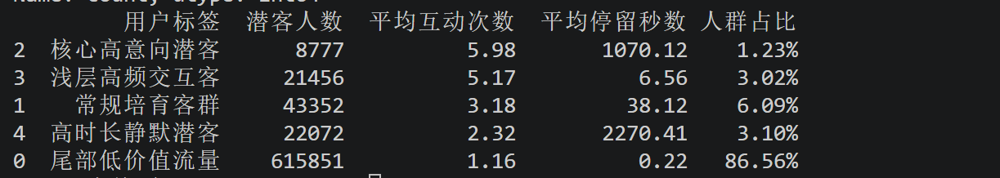

本次潜客分层结果深刻揭示了未成交转化漏斗的“极度右偏（长尾）特征”：高达 86.5% 的流量为点击即走的无效跳出，而真正突破重围的“核心高意向潜客”仅占 1.2%。这组真实数据精准论证了意向分层模型的巨大商业价值：帮助业务团队剥离海量噪音，将有限的预算聚焦于那 1.2% 的高优金矿人群，实现极端的控本增效。

**核心高意向潜客：**

​	数据表现：仅占总人数的 **1.23%**（8,777人）。但活跃度处于绝对高位，平均互动次数达 **5.98** 次，平均停留时长高达 **1070.12** 秒	（近 18 分钟）。

​	业务洞察：这是漏斗最底部的“准买家”，距离首单仅一步之遥。必须倾斜最核心的营销资源，通过定向触发“新人限时大额首单券”或	实施高优的购物车流失挽回策略，极速促结单。

**浅层高频交互客：**

​	数据表现：人数占比 **3.02%**（21,456人）。其平均互动次数高达 **5.17** 次，但平均停留时长极短，仅为 **6.56** 秒。

​	业务洞察：典型表现为“疯狂点击但火速跳出”，暴露出严重的“人货错配”问题。建议将该群体数据回流给推荐算法（RecSys）团队，	作为优化商品召回相关性与排序策略的核心测试样本。

**高时长静默潜客：**

​	数据表现：人数占比 **3.10%**（22,072人）。平均停留时长全站最高，达 **2270.41** 秒（约 37 分钟），但平均互动次数仅为 **2.32** 次。

​	业务洞察：用户耗费大量时间浏览却未触发深度交互（如加购），暴露出商品详情页（PDP）存在高决策摩擦。业务需反思并排查是	否存在信息过载、缺乏信任背书或购买引导（CTA）设计不明确。

**常规培育客群：**

​	数据表现：人数占比 **6.09%**（43,352人）。平均互动 **3.18** 次，平均停留 **38.12** 秒，各项数据表现平庸且居中。

​	业务洞察：作为基础流量客户群，无需投入高额成本。建议接入标准化的自动化营销 SOP（如 App 常规 Push、类目上新红点提	醒），进行长效的心智培育。

**尾部低价值流量：**

​	数据表现：占据绝对大头，占比高达 **86.56%**（615,851人）。互动与停留均垫底，平均互动仅 **1.16** 次，平均停留时间低至 **0.22** 	秒。

​	业务洞察：典型的无效跳出流量或爬虫噪音。在营销端必须将其列入“免触达黑名单”，彻底切断该群体的通道费消耗，实现极致的营销成本控制。


## 7.全量数据分析

在Dbeaver里执行sql语句对全量数据进行分析

“*（注：开源环境复现时，请将 SQL 与 Python 脚本中的 `D:\实战项目\...` 绝对路径统一替换为当前运行环境的相对路径）*”

```

CREATE TABLE full_user_features AS

WITH t1 AS (
    SELECT 
        user_id,
        MAX(CASE WHEN event_type = 'purchase' THEN event_time ELSE NULL END) AS Recency,
        COUNT(CASE WHEN event_type = 'purchase' THEN 1 ELSE NULL END) AS Frequency,
        SUM(CASE WHEN event_type = 'purchase' THEN price ELSE 0 END) AS monetary,
        COUNT(CASE WHEN event_type IN ('view', 'cart') THEN 1 ELSE NULL END) AS Intent
    FROM read_csv_auto('D:\实战项目\Dataanalysis\archive\*.csv')
    GROUP BY user_id
),

t2 AS (
    SELECT
        user_id,
        AVG(session_duration) AS avg_session
    FROM (
        SELECT
            user_id,
            user_session,
            (MAX(event_time) - MIN(event_time)) AS session_duration
        FROM read_csv_auto('D:\实战项目\Dataanalysis\archive\*.csv')
        WHERE user_session IS NOT NULL
        GROUP BY user_id, user_session
    ) A
    GROUP BY user_id
)

SELECT
    t1.*,
    t2.avg_session
FROM t1 
LEFT JOIN t2 ON t1.user_id = t2.user_id;
```


```
CREATE OR REPLACE TABLE full_user_tags AS

WITH 
MaxDate AS (
    SELECT MAX(Recency) AS anchor_time 
    FROM full_user_features
),

CleanedFeatures AS (
    SELECT 
        user_id,
        COALESCE(Frequency, 0) AS F_val,
        COALESCE(monetary, 0) AS M_val,
        COALESCE(Intent, 0) AS I_val,
        COALESCE(EXTRACT('epoch' FROM avg_session), 0) AS S_val,
        COALESCE(
            date_diff('day', Recency, (SELECT anchor_time FROM MaxDate)), 
            999 
        ) AS R_val
    FROM full_user_features 
),

PotentialTags AS (
    SELECT 
        user_id,
        CASE 
            WHEN I_val >= 3 AND S_val >= 180 THEN '核心高意向潜客'
            WHEN S_val >= 180 AND I_val < 3 THEN '高时长静默潜客'
            WHEN I_val >= 3 AND S_val < 60 THEN '浅层高频交互客'
            WHEN I_val <= 2 AND S_val <= 60 THEN '尾部低价值流量'
            ELSE '常规培育客群'
        END AS 用户标签,
        '潜客' AS 用户大类
    FROM CleanedFeatures
    WHERE F_val = 0
),

ActiveTags AS (
    SELECT 
        user_id,
        CASE 
            WHEN M_val >= 900 AND R_val <= 30 THEN '核心高价值客户'  
            WHEN M_val >= 900 AND R_val > 30 THEN '重要挽留客户' 
            WHEN F_val = 1 AND M_val >= 400 AND I_val >= 4 THEN '高潜单次大客'
            WHEN M_val < 400 AND I_val >= 4 THEN '高互动普通客'
            WHEN F_val = 1 AND M_val <= 200 AND I_val <= 2 THEN '低价值流失客'
            ELSE '一般客户'
        END AS 用户标签,
        '成交客' AS 用户大类
    FROM CleanedFeatures
    WHERE F_val > 0
)
SELECT * FROM PotentialTags
UNION ALL
SELECT * FROM ActiveTags;
```

```
SELECT 
    用户大类,
    用户标签, 
    COUNT(*) AS 人数 
FROM full_user_tags 
GROUP BY 用户大类, 用户标签 
ORDER BY 用户大类, 人数 DESC;
```

运行结果

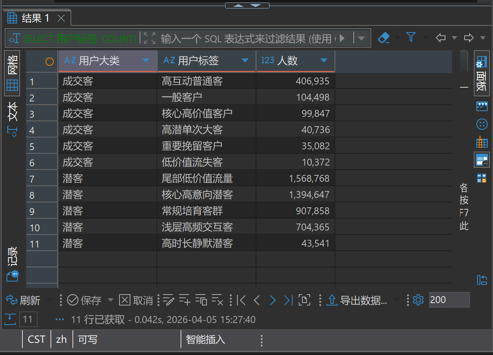

```
COPY (
    SELECT 
        t.user_id, 
        t.用户大类, 
        t.用户标签,
        COALESCE(f.monetary, 0) AS GMV
    FROM full_user_tags t
    LEFT JOIN full_user_features f ON t.user_id = f.user_id
) TO 'D:\实战项目\Dataanalysis\BI_data.csv' (HEADER, DELIMITER ',');
```

将全量标签表导出为 Power BI 专用的分析文件
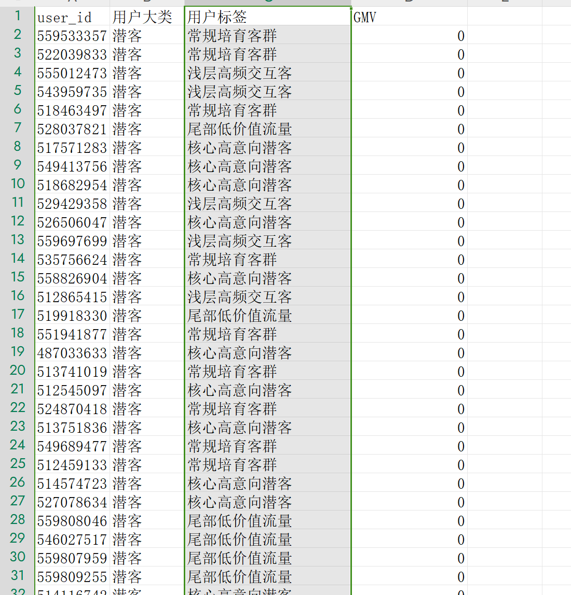

## 8.PowerBI可视化

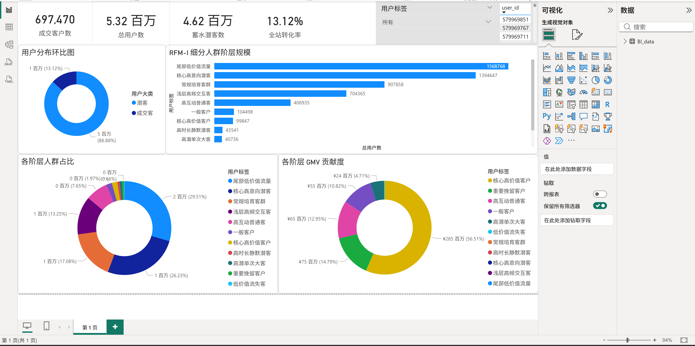

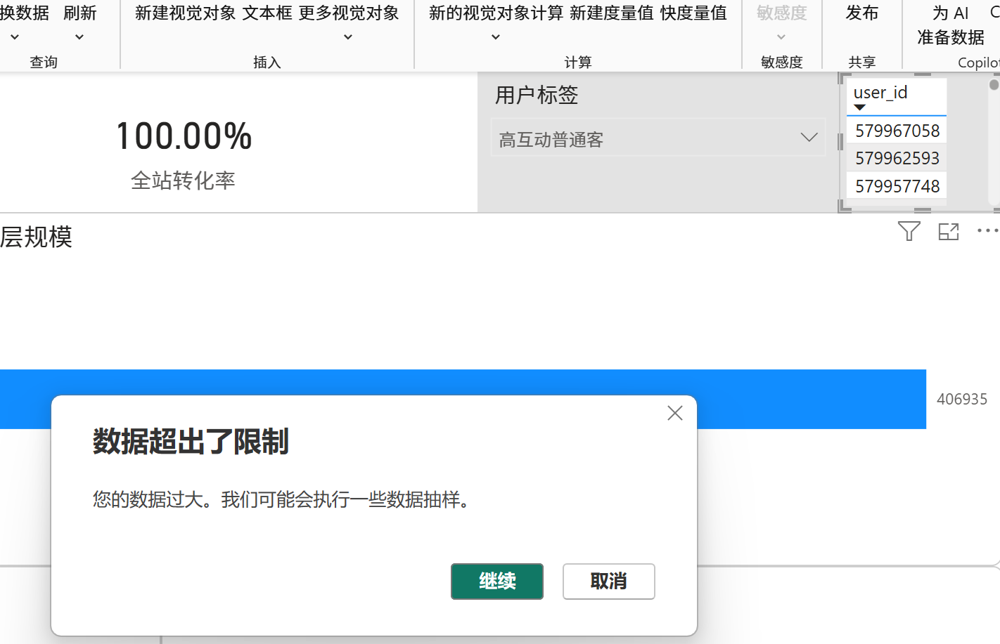

在这里我们可以使用Power BI选择用户标签导出业务方所需要的用户id，但是Power BI 的视觉对象导出是有上限的（通常明细表导出 CSV 上限为 3 万行，开启大模型支持可达 15 万行左右），所以少量数据可以直接导出，但是大量数据我们还是回到DBeaver里使用sql语句导出。


## 9.业务场景

```
-- 场景 A：提取 139 万【核心高意向潜客】去发新人券
COPY (
    SELECT user_id
    FROM full_user_tags
    WHERE 用户标签 = '核心高意向潜客'
) TO 'D:\实战项目\Dataanalysis\target_high_intent.csv' (HEADER, DELIMITER ',');

-- 场景 B：提取几百万【尾部低价值流量】扔进广告投放黑名单
COPY (
    SELECT user_id
    FROM full_user_tags
    WHERE 用户标签 = '尾部低价值流量'
) TO 'D:\实战项目\Dataanalysis\exclude_low_value.csv' (HEADER, DELIMITER ',');
```

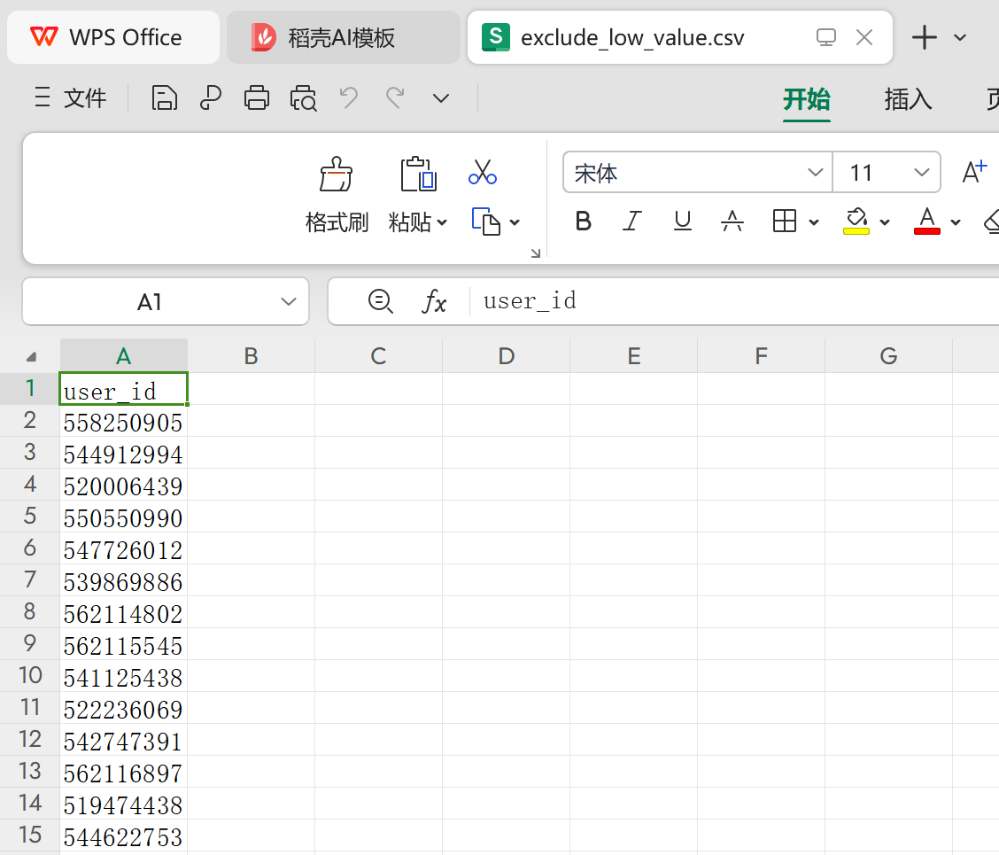

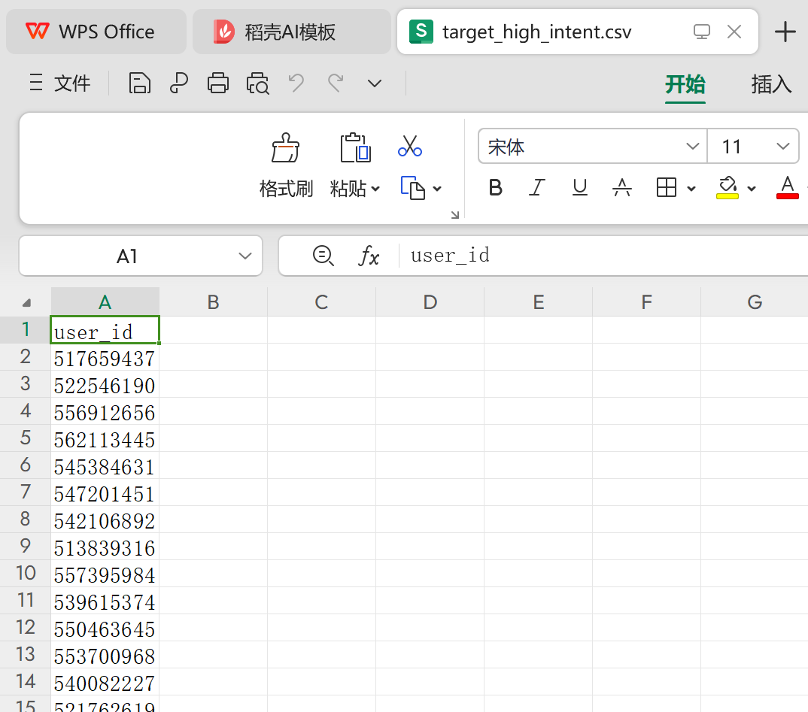


## 10. 项目总结与业务赋能
本项目从零到一构建了千万级真实电商用户的行为特征管道。在技术链路端，通过 DuckDB + CTE 架构成功解决了海量明细日志（13GB）在单机环境下的内存爆炸与降维聚合问题；在业务应用端，打破了传统 RFM 模型的 5 分制局限，创新性引入 Intent（意向因子）重构分层体系。最终不仅实现了大盘数据在 Power BI 中的自动化监控，更精准定位了 1.2% 的核心高意向潜客与 86% 的尾部无效流量，为后续营销资源的“控本增效”提供了直接的底层数据支撑。
